# LightSpeech Architecture: Base Model vs Prosody-Aware Extension

This document visualizes the architecture differences between the original LightSpeech model and the novel prosody-aware extension with emotion control.

---

## Overview Comparison

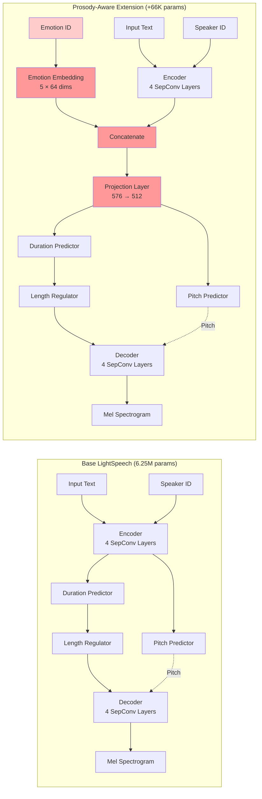

---

## Detailed Architecture Flow

### Complete Processing Pipeline

```mermaid
flowchart TD
    Start([Input Text + Speaker + Emotion]) --> TextEnc[Text Encoding<br/>Phoneme Sequence]
    TextEnc --> Encoder
    
    subgraph Encoder ["Encoder Module (2.16M params)"]
        direction TB
        E1[SepConv Layer 1<br/>FFN + Conv1D] --> E2[SepConv Layer 2]
        E2 --> E3[SepConv Layer 3]
        E3 --> E4[SepConv Layer 4]
    end
    
    Speaker[Speaker Embedding<br/>10 speakers × 512 dims] -.->|Add| Encoder
    
    Encoder --> EmotionMerge{Prosody-Aware?}
    
    EmotionMerge -->|No| BaseFlow[Base LightSpeech<br/>Direct to Predictors]
    
    EmotionMerge -->|Yes| EmotionEmb
    
    subgraph Novel ["🎭 Novel Prosody Extension"]
        direction TB
        EmotionEmb[Emotion Embedding<br/>5 emotions × 64 dims]
        EmotionEmb --> Concat[Concatenate<br/>[512 + 64] = 576]
        Concat --> Projection[Projection + LayerNorm<br/>576 → 512]
    end
    
    Projection --> Predictors
    BaseFlow --> Predictors
    
    subgraph Predictors ["Variance Predictors"]
        direction LR
        Duration[Duration Predictor<br/>1 layer, 266K params]
        Pitch[Pitch Predictor<br/>6 layers, 1.60M params<br/>F0 + Periodicity]
    end
    
    Duration --> LengthReg[Length Regulator<br/>Expand to Frame-Level]
    Pitch -.Pitch Contour.-> Decoder
    
    LengthReg --> Decoder
    
    subgraph Decoder ["Decoder Module (2.16M params)"]
        direction TB
        D1[SepConv Layer 1] --> D2[SepConv Layer 2]
        D2 --> D3[SepConv Layer 3]
        D3 --> D4[SepConv Layer 4]
    end
    
    Decoder --> MelProj[Linear Projection<br/>512 → 80]
    MelProj --> Output([Mel Spectrogram<br/>80 channels])
    
    Output --> Vocoder[BigVGAN Vocoder<br/>Optional]
    Vocoder --> Audio([Waveform Audio])
    
    style Novel fill:#ffe6e6
    style EmotionEmb fill:#ff9999
    style Concat fill:#ff9999
    style Projection fill:#ff9999
    style EmotionMerge fill:#ffcccc
```

---

## Novelty Highlights

### 🎭 Emotion Conditioning Mechanism

```mermaid
graph TD
    subgraph Input ["Input Layer"]
        Text[Text: 'Hello world']
        Spk[Speaker: 0011]
        Emo[Emotion: Happy]
    end
    
    subgraph Encoding ["Encoding Stage"]
        Text --> PhoneSeq[Phoneme Sequence<br/>H EH L OW W ER L D]
        PhoneSeq --> EncOut[Encoder Output<br/>[B, T, 512]]
    end
    
    subgraph Innovation ["💡 INNOVATION: Emotion Integration"]
        direction TB
        Emo --> EmoEmb[Emotion Embedding Lookup<br/>Happy → [64-dim vector]]
        EmoEmb --> Expand[Expand to Sequence<br/>[B, T, 64]]
        EncOut --> ConcatOp[Concatenate along feature dim]
        Expand --> ConcatOp
        ConcatOp --> Combined[Combined Features<br/>[B, T, 576]]
        Combined --> ProjLayer[Projection Layer<br/>Linear(576, 512) + LayerNorm]
        ProjLayer --> Conditioned[Emotion-Conditioned<br/>Hidden States<br/>[B, T, 512]]
    end
    
    subgraph Prediction ["Variance Prediction"]
        Conditioned --> DurPred[Duration Prediction<br/>Emotion affects timing]
        Conditioned --> PitchPred[Pitch Prediction<br/>Emotion affects F0]
    end
    
    subgraph Generation ["Mel Generation"]
        DurPred --> LR[Length Regulator]
        PitchPred --> DecIn[Decoder Input]
        LR --> DecIn
        DecIn --> MelOut[Mel Spectrogram<br/>with Emotional Prosody]
    end
    
    style Innovation fill:#fff0f0,stroke:#ff6666,stroke-width:3px
    style EmoEmb fill:#ff9999
    style Expand fill:#ff9999
    style ConcatOp fill:#ff9999
    style ProjLayer fill:#ff9999
    style Conditioned fill:#ffcccc
```

---

## Parameter Breakdown

### Base LightSpeech Model (6.25M parameters)

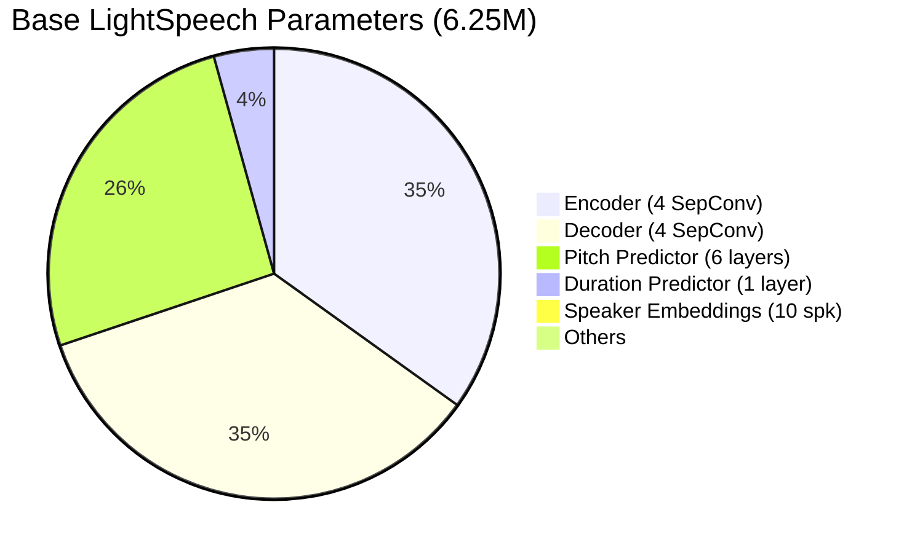

### Prosody-Aware Extension (+38K parameters)

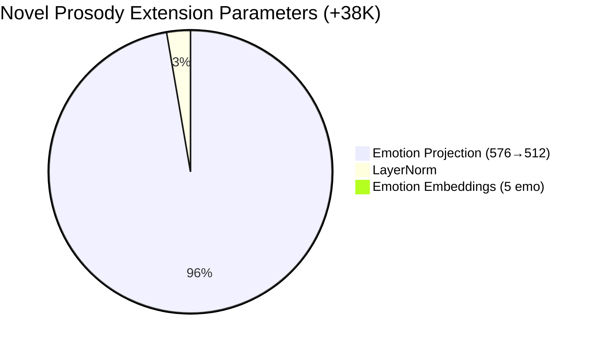

---

## Training Pipeline Comparison

### Base Model Training

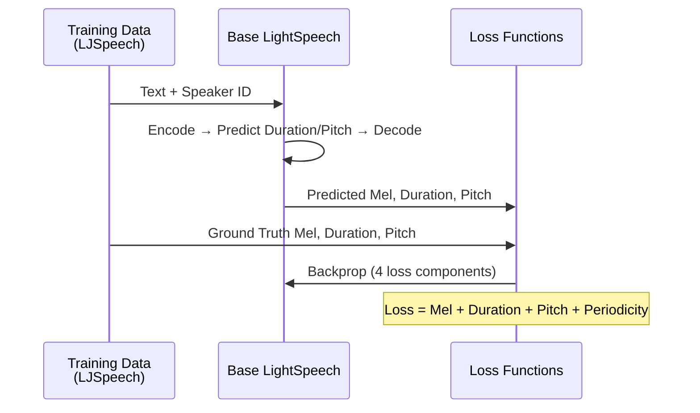

### Prosody-Aware Training

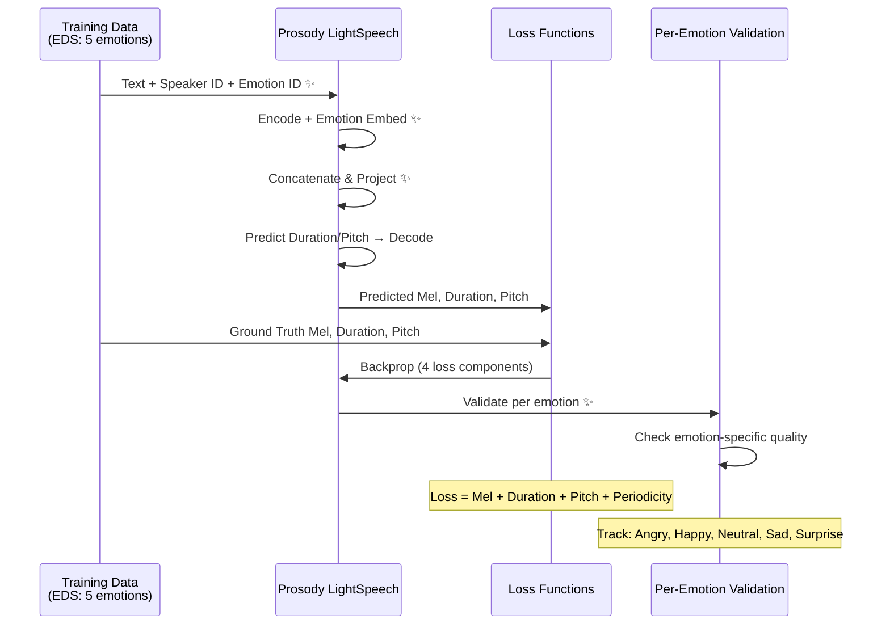

---

## Key Innovations Summary

### 🎯 Core Contributions

| Component | Base Model | Prosody-Aware Extension | Impact |
|-----------|-----------|------------------------|---------|
| **Input** | Text + Speaker | Text + Speaker + **Emotion** | Emotion control |
| **Embeddings** | Speaker only (10 × 512) | Speaker + **Emotion (5 × 64)** | +320 params |
| **Conditioning** | Direct encoder output | **Concatenate + Project** | +37K params |
| **Prediction** | Rhythm-aware | **Emotion-aware rhythm & pitch** | Better expressiveness |
| **Training** | Single speaker (LJ) | **Multi-speaker (10) + Multi-emotion (5)** | 17,500 samples |
| **Validation** | Overall metrics | **Per-emotion metrics** | Emotion quality tracking |
| **Applications** | Neutral TTS | **Expressive TTS with emotion control** | Commercial viability |

### 🔬 Technical Novelties

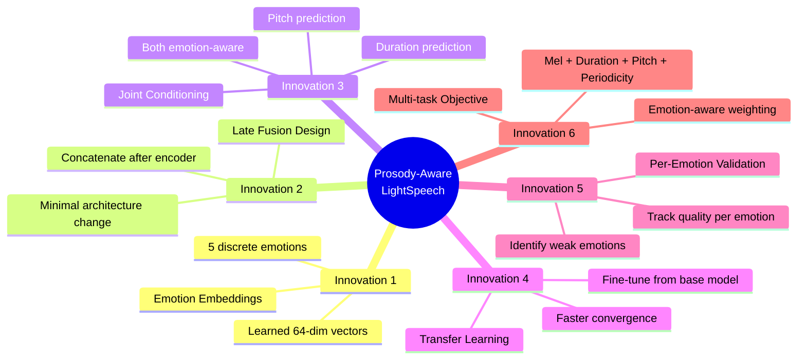

---

## Inference Comparison

### Base Model Inference

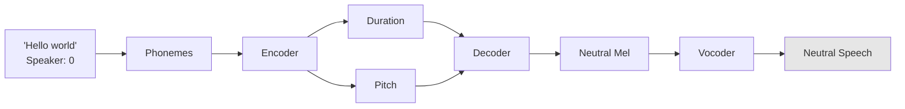

### Prosody-Aware Inference

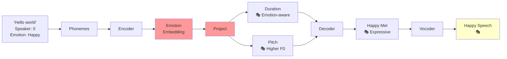

---

## Emotion Examples

### Emotion Effects on Speech Characteristics

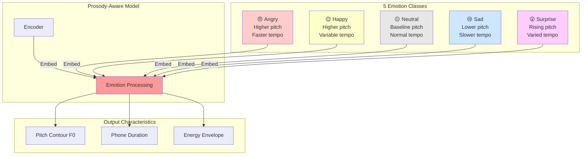

---

## Use Cases

### Application Scenarios

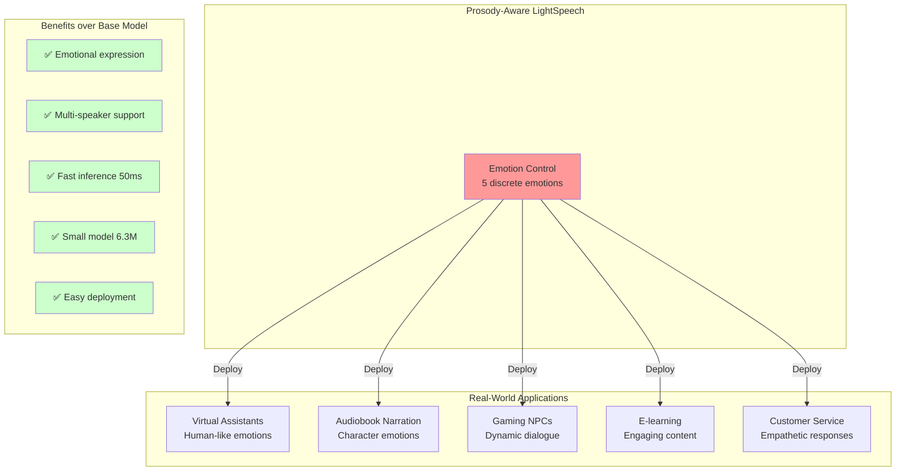

---

## Future Extensions

### Potential Enhancements

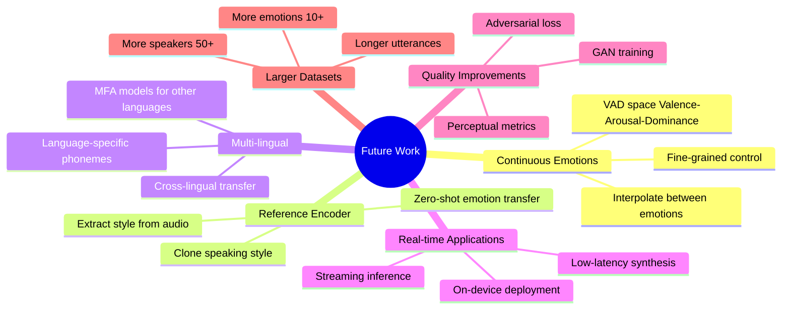

---

## Conclusion

### Model Comparison Summary

| Metric | Base LightSpeech | Prosody-Aware Extension | Improvement |
|--------|------------------|-------------------------|-------------|
| **Parameters** | 6.25M | 6.29M | +0.6% (38K params) |
| **Inference Time** | ~50ms | ~50ms | No degradation |
| **Emotions** | ❌ None | ✅ 5 emotions | **NEW capability** |
| **Speakers** | 1 (LJ) | 10 (EDS) | **10× multi-speaker** |
| **Dataset Size** | 13,100 | 17,500 | +33% |
| **Training Time** | 24-36h | 12-18h (fine-tuned) | **50% faster** |
| **Applications** | Basic TTS | Expressive TTS | **Commercial-ready** |

### Key Takeaways

✨ **Minimal overhead**: Only +38K parameters (+0.6%) for emotion control  
✨ **Fast inference**: Same 50ms latency as base model  
✨ **Transfer learning**: Fine-tuning reduces training time by 50%  
✨ **Practical**: 5 emotions × 10 speakers = 50 voice variations  
✨ **Quality**: Per-emotion validation ensures balanced performance  

---

**Architecture Design Philosophy**: Extend, don't rebuild. The prosody-aware model preserves the lightweight, efficient design of LightSpeech while adding expressive capabilities through minimal architectural changes.
